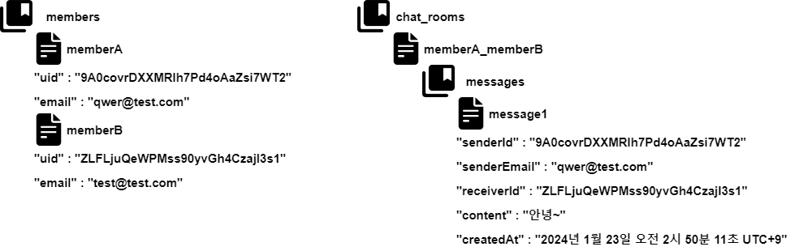
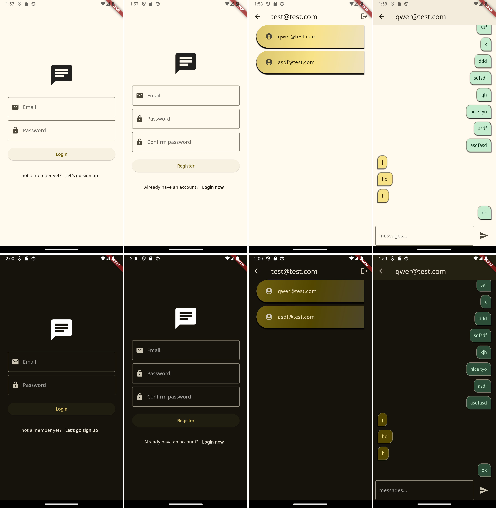

# chat

Flutter Chatting Project.

## 언어 & 도구

- Dart
- Flutter
- Android Studio IDE

## 라이브러리

- google_fonts
- provider
- firebase_core
- firebase_auth
- cloud_firestore

## Firebase 구조

## 주요 기능

- 회원가입
- 로그인
- 사용자 목록
- 채팅 메시지 목록
- 로그인 상태를 관리하기 위해 상태관리 라이브러리인 Provider 를 사용.
- Firebase Realtime changes로 실시간으로 변경된 데이터(사용자 목록, 메시지 목록)만 반영되도록 함.
- [Material Theme Builder](https://material-foundation.github.io/material-theme-builder/) 를 사용해서 시스템 설정에 따라 라이트 모드, 다크 모드가 자동으로 적용되도록 함.
